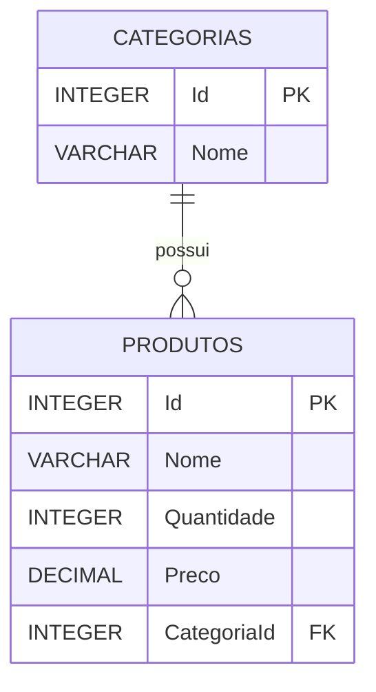
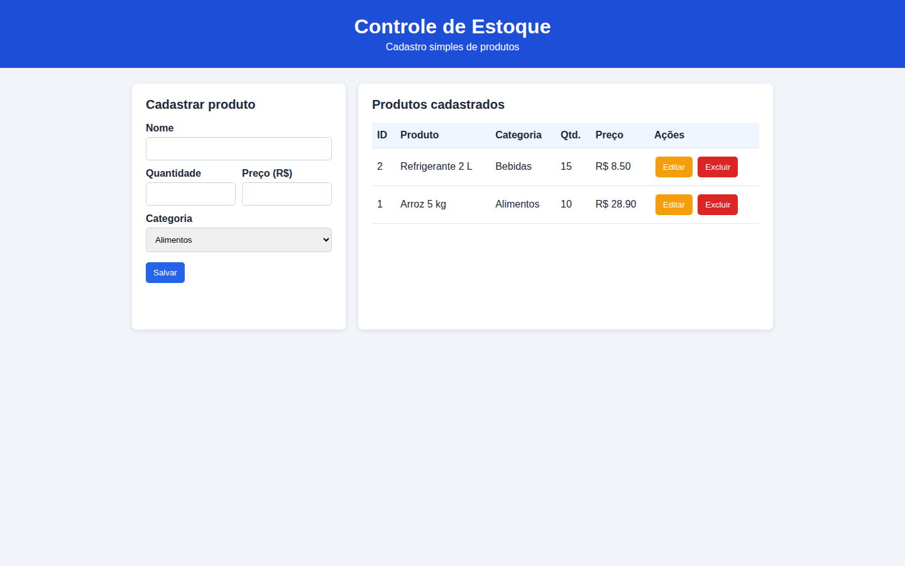
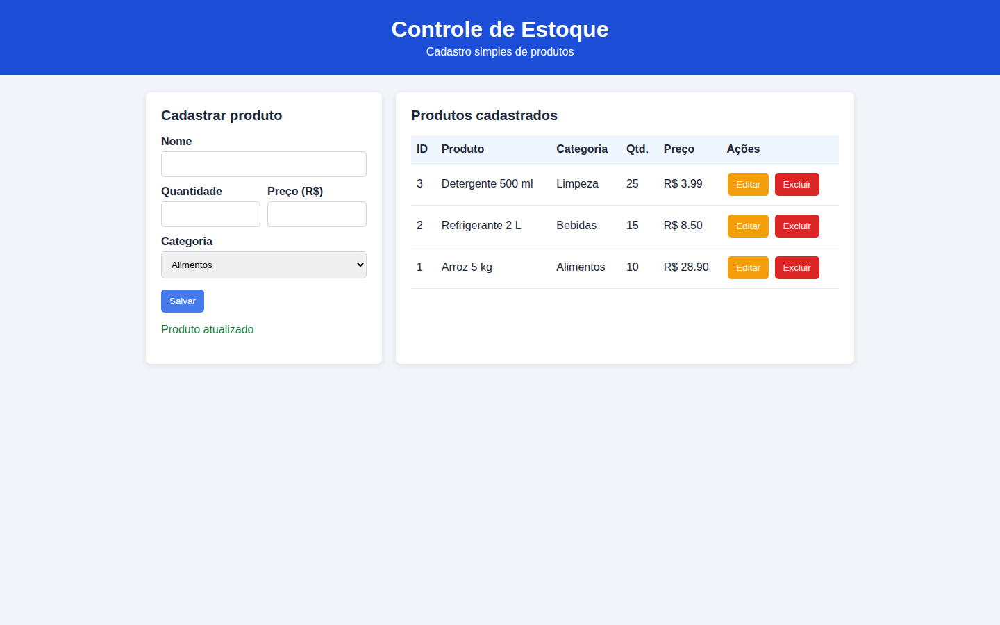
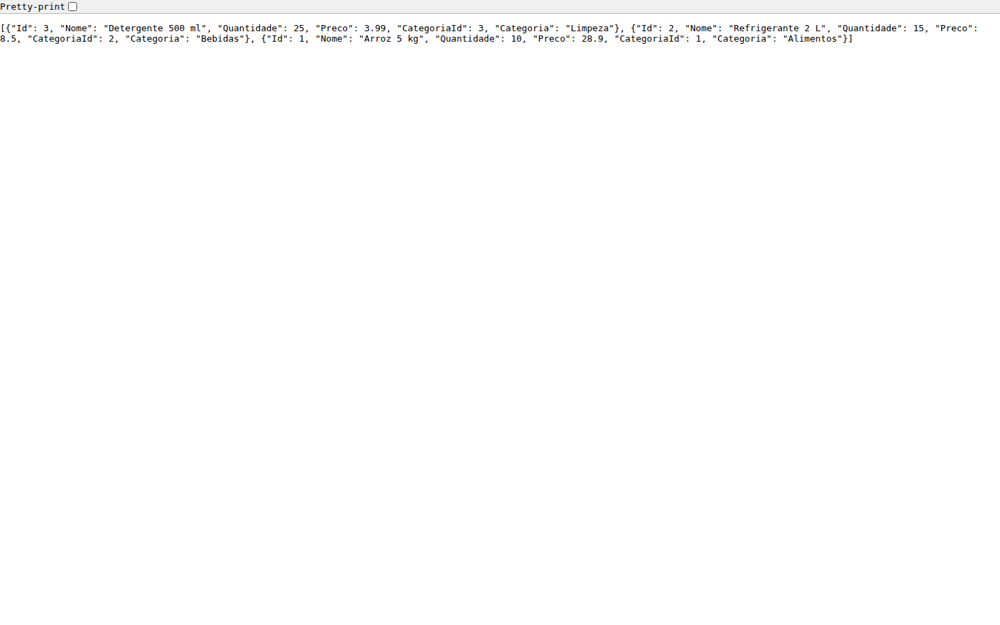
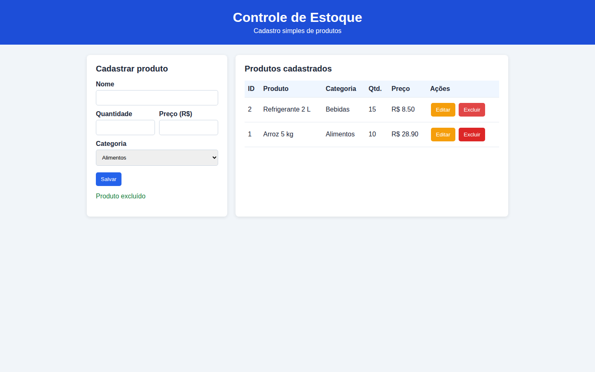

# Sistema de Controle de Estoque

## 1. Identificação institucional

- Instituição: Universidade Paulista - UNIP
- Curso: Análise e Desenvolvimento de Sistemas
- Turma: DS4Q17
- Disciplina: Banco de Dados
- Professor: Fernando Bueno
- Integrantes:
  - Hendryo Batista Sarmento - R661946
  - Lucas Alcântara Leal - H32CIA9
  - Matheus Terci - T319595
  - Cauã Paiva de Lima Nunes - H5812J3

> A atividade exige de 3 a 6 integrantes.

## 2. Descrição do projeto

O projeto é um sistema simples para controlar produtos em estoque. Ele permite cadastrar, consultar, editar e excluir produtos. Cada produto pertence a uma categoria.

### Regras de negócio

- O nome do produto é obrigatório.
- A quantidade e o preço não podem ser negativos.
- Todo produto deve possuir uma categoria.
- Uma categoria pode possuir vários produtos.

## 3. Tecnologias utilizadas

- Python 3, somente com bibliotecas padrão (`http.server`, `sqlite3` e `json`).
- SQLite.
- HTML5, CSS3 e JavaScript puro.
- Nenhum framework ou ORM foi utilizado.

## 4. Modelagem do banco de dados



O script DDL completo está no arquivo `database.sql`.

## 5. Operações CRUD

- Create: cadastro de um produto.
- Read: listagem dos produtos com sua categoria.
- Update: alteração dos dados de um produto.
- Delete: exclusão de um produto.

As operações usam instruções SQL diretas e parâmetros `?` para os valores informados pelo usuário.

## 6. Como executar

1. Instale o Python 3.
2. Baixe ou clone o repositório.
3. Abra o terminal dentro da pasta do projeto.
4. Execute:

```bash
python app.py
```

5. Abra `http://localhost:8000` no navegador.
6. Para encerrar, pressione `Ctrl + C` no terminal.

O banco `estoque.db` é criado automaticamente na primeira execução. Não é necessário instalar pacotes adicionais.

## 7. Estrutura dos arquivos

- `app.py`: servidor, conexão e comandos SQL do CRUD.
- `database.sql`: criação das tabelas e dados iniciais.
- `index.html`: estrutura da interface.
- `style.css`: aparência e responsividade.
- `script.js`: ações da página e comunicação com o servidor.

## 8. Evidências visuais

As imagens abaixo foram obtidas durante uma execução real do sistema, utilizando o banco SQLite e as operações CRUD.

### Tela inicial

Produtos iniciais carregados do banco de dados.



### Cadastro de produto

Cadastro do produto "Detergente 500 ml" com 20 unidades.


### Atualização de produto

Quantidade do detergente atualizada de 20 para 25 unidades.



### Persistência no banco de dados

Consulta da API após a atualização, mostrando o produto armazenado com 25 unidades.



### Exclusão de produto

Produto removido e lista retornando aos registros iniciais.


